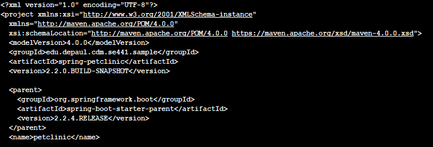
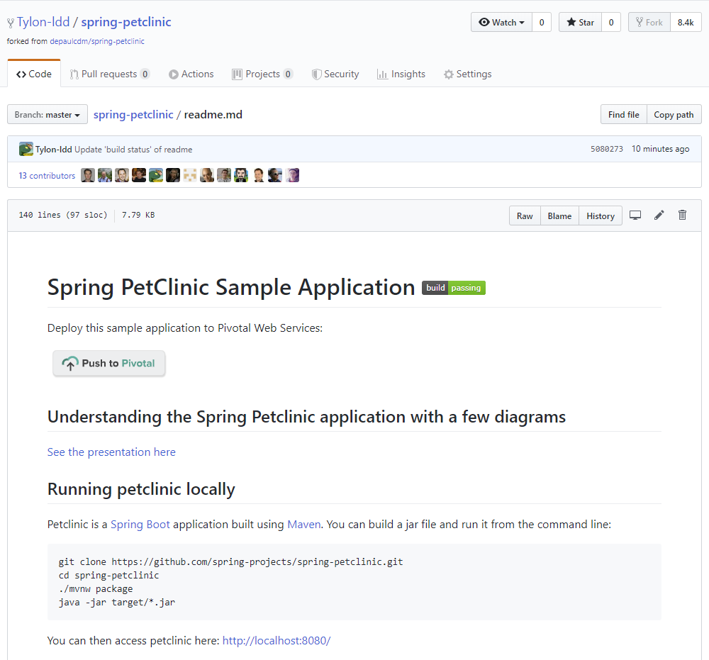

# Instructions
Dongdong Li (ID: 1924542)

Add your screen captures to a new directory called [images](images).

# Deliverables [50 pts]
- [5 pts] Your Github account showing that is has been forked from the depaulcdm/springpetclinic
repository.

- [5 pts] Your Travis CI dashboard showing a successful first build.

- [5 pts] The section of the POM file showing the coordinates after you’ve changed them.

- [5 pts] Your Travis CI dashboard showing a successful build after your change of the group
ID.

- [5 pts] The section of the POM file showing the coordinates after you’ve commented them
out.

- [5 pts] Your Travis CI dashboard showing the unsuccessful build after the breaking change.

- [5 pts] Your Github repository with the readme.md file selected showing the build failed
status after the Travis CI build fails.

- [5 pts] The section of the POM file showing the coordinates after you’ve fixed them.

- [5 pts] Your Travis CI dashboard showing the successful build after the breaking change has
been fixed.

- [5 pts] Your Github repository with the readme.md file selected showing the build success
status after the Travis CI build has recovered.

